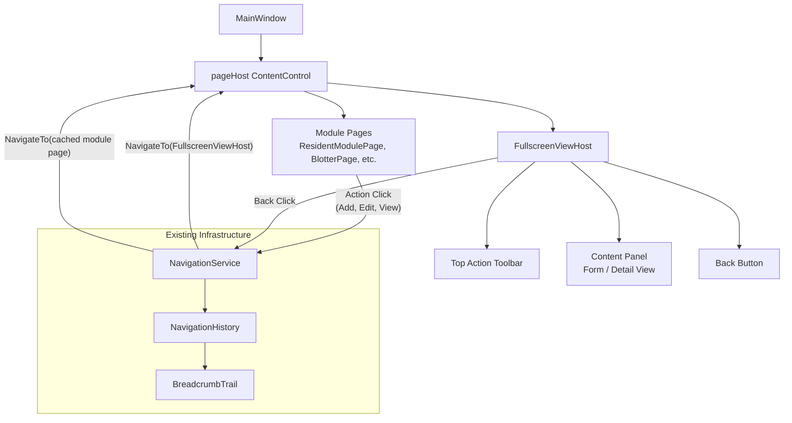
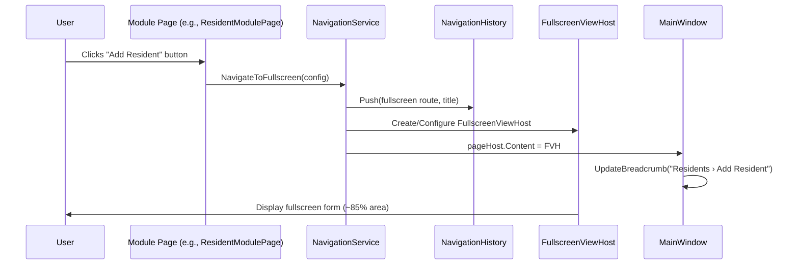
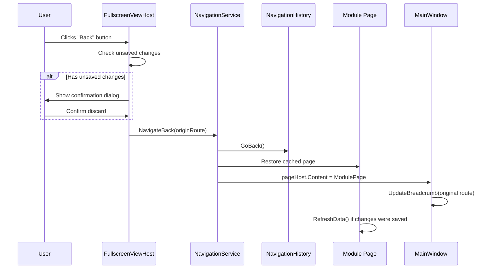
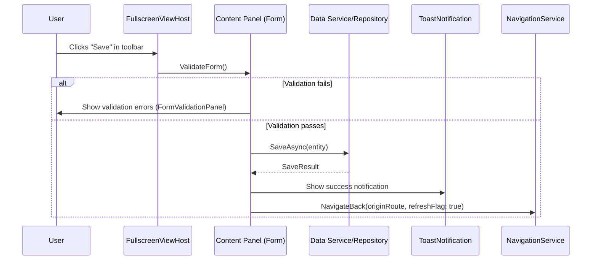

# Design Document: Fullscreen Data Table Views

## Overview

This feature replaces the current modal dialog pattern (separate Window instances opened via `ShowDialog()`) with an in-app fullscreen data table view that covers approximately 85% of the screen area. When users click action buttons (e.g., "Add Resident", "File New Case") inside any module page, instead of spawning a new Window, the system navigates to a fullscreen overlay panel within the existing ContentControl host. This panel contains the relevant data entry form, action buttons positioned at the top or side, and a prominent "Back" button to return to the originating page.

The design leverages the existing `NavigationService` singleton and its page caching mechanism (`GetOrCreate`), the `NavigationHistory` (BreadcrumbTrail) for back/forward support, and the established `ModulePageBase` layout pattern. The fullscreen view is implemented as a new `FullscreenViewHost` UserControl that acts as a container, providing consistent chrome (back button, title, action toolbar) while hosting module-specific content panels.

This pattern will be applied consistently across all 20+ module pages, replacing ~35 dialog windows with in-app fullscreen views that feel more integrated and less disruptive to the user's workflow.

## Architecture



## Sequence Diagrams

### Opening a Fullscreen View from a Module Page



### Returning from Fullscreen View



### Saving Data in Fullscreen View



## Components and Interfaces

### Component 1: FullscreenViewHost

**Purpose**: Reusable container UserControl that provides consistent fullscreen view chrome — back button, title area, action toolbar, and a content presenter for module-specific forms.

**Interface**:
```csharp
public class FullscreenViewHost : UserControl
{
    // Dependency Properties
    public static readonly DependencyProperty ViewTitleProperty;
    public static readonly DependencyProperty ViewSubtitleProperty;
    public static readonly DependencyProperty OriginRouteProperty;
    public static readonly DependencyProperty ContentAreaProperty;
    public static readonly DependencyProperty ToolbarItemsProperty;
    public static readonly DependencyProperty ShowSideToolbarProperty;

    // Properties
    public string ViewTitle { get; set; }
    public string ViewSubtitle { get; set; }
    public string OriginRoute { get; set; }
    public UIElement ContentArea { get; set; }
    public IList<UIElement> ToolbarItems { get; set; }
    public bool ShowSideToolbar { get; set; }

    // Events
    public event EventHandler<NavigatingBackEventArgs> NavigatingBack;
    public event EventHandler BackCompleted;

    // Methods
    public void NavigateBack();
    public void SetUnsavedChanges(bool hasChanges);
}

public class NavigatingBackEventArgs : EventArgs
{
    public bool Cancel { get; set; }
    public bool HasUnsavedChanges { get; }
    public string OriginRoute { get; }
}
```

**Responsibilities**:
- Render consistent header with back button, title, and subtitle
- Host action toolbar (top or side position based on `ShowSideToolbar`)
- Provide content presenter area (~85% of available space)
- Handle back navigation with unsaved changes confirmation
- Integrate with NavigationService for route management
- Apply entrance/exit animations consistent with existing page transitions

### Component 2: FullscreenNavigationExtensions

**Purpose**: Extension methods on `NavigationService` to simplify fullscreen view navigation from any module page.

**Interface**:
```csharp
public static class FullscreenNavigationExtensions
{
    public static void NavigateToFullscreen(
        this NavigationService nav,
        FullscreenViewConfig config);

    public static void NavigateBackFromFullscreen(
        this NavigationService nav,
        string originRoute,
        bool refreshOnReturn = false);
}

public class FullscreenViewConfig
{
    public string Title { get; set; }
    public string Subtitle { get; set; }
    public string OriginRoute { get; set; }
    public UIElement Content { get; set; }
    public IList<UIElement> ToolbarItems { get; set; }
    public bool ShowSideToolbar { get; set; }
    public Action OnSaved { get; set; }
}
```

**Responsibilities**:
- Create and configure `FullscreenViewHost` from a config object
- Push navigation history entry for breadcrumb support
- Handle return navigation and optional data refresh callback

### Component 3: FullscreenFormBase

**Purpose**: Optional base class for fullscreen form content panels, providing common form infrastructure (validation, dirty tracking, save/cancel).

**Interface**:
```csharp
public abstract class FullscreenFormBase : UserControl
{
    // Properties
    public bool IsDirty { get; protected set; }
    public bool IsValid { get; protected set; }

    // Abstract methods for subclasses
    protected abstract bool ValidateForm();
    protected abstract Task<bool> SaveAsync();
    protected abstract void ResetForm();

    // Events
    public event EventHandler<bool> DirtyStateChanged;
    public event EventHandler SaveCompleted;

    // Methods
    public async Task<bool> TrySaveAsync();
    public bool ConfirmDiscard();
}
```

**Responsibilities**:
- Track form dirty state and notify the host
- Provide validation infrastructure
- Handle async save operations with loading state
- Confirm discard on navigation away with unsaved changes

### Component 4: FullscreenViewStyles (ResourceDictionary)

**Purpose**: XAML ResourceDictionary containing all styles specific to the fullscreen view pattern, ensuring visual consistency across all modules.

**Interface** (XAML resource keys):
```csharp
// Style keys defined in FullscreenViewStyles.xaml
public static class FullscreenViewStyleKeys
{
    public const string HostBorderStyle = "FullscreenHostBorderStyle";
    public const string BackButtonStyle = "FullscreenBackButtonStyle";
    public const string TitleStyle = "FullscreenTitleStyle";
    public const string SubtitleStyle = "FullscreenSubtitleStyle";
    public const string ToolbarPanelStyle = "FullscreenToolbarPanelStyle";
    public const string SideToolbarStyle = "FullscreenSideToolbarStyle";
    public const string ContentPresenterStyle = "FullscreenContentPresenterStyle";
    public const string SaveButtonStyle = "FullscreenSaveButtonStyle";
    public const string CancelButtonStyle = "FullscreenCancelButtonStyle";
}
```

**Responsibilities**:
- Define consistent visual styling for all fullscreen views
- Use existing design tokens (Slate palette, rounded corners, shadows)
- Provide responsive layout that fills ~85% of available space
- Include entrance/exit animation storyboards

## Data Models

### FullscreenViewConfig

```csharp
public class FullscreenViewConfig
{
    /// <summary>
    /// Display title shown in the fullscreen view header.
    /// </summary>
    public string Title { get; set; } = string.Empty;

    /// <summary>
    /// Optional subtitle/description below the title.
    /// </summary>
    public string Subtitle { get; set; } = string.Empty;

    /// <summary>
    /// The route key of the originating page (for back navigation).
    /// </summary>
    public string OriginRoute { get; set; } = string.Empty;

    /// <summary>
    /// The content UserControl to display in the fullscreen area.
    /// </summary>
    public UIElement Content { get; set; }

    /// <summary>
    /// Action buttons to display in the toolbar area.
    /// </summary>
    public IList<UIElement> ToolbarItems { get; set; } = new List<UIElement>();

    /// <summary>
    /// If true, toolbar is rendered as a vertical side panel. Otherwise, horizontal top bar.
    /// </summary>
    public bool ShowSideToolbar { get; set; } = false;

    /// <summary>
    /// Callback invoked when data is saved, allowing the origin page to refresh.
    /// </summary>
    public Action? OnSaved { get; set; }

    /// <summary>
    /// Optional icon (FontAwesome) for the view header.
    /// </summary>
    public IconChar? Icon { get; set; }
}
```

**Validation Rules**:
- `Title` must not be null or empty
- `OriginRoute` must be a valid route key recognized by NavigationService
- `Content` must not be null
- `ToolbarItems` may be empty (back button is always present)

### NavigatingBackEventArgs

```csharp
public class NavigatingBackEventArgs : EventArgs
{
    public bool Cancel { get; set; } = false;
    public bool HasUnsavedChanges { get; }
    public string OriginRoute { get; }
    public bool RefreshOnReturn { get; set; } = false;

    public NavigatingBackEventArgs(string originRoute, bool hasUnsavedChanges)
    {
        OriginRoute = originRoute;
        HasUnsavedChanges = hasUnsavedChanges;
    }
}
```

**Validation Rules**:
- `OriginRoute` must not be null
- If `HasUnsavedChanges` is true and `Cancel` is not set, a confirmation dialog must be shown

## Algorithmic Pseudocode

### Main Navigation Algorithm

```csharp
/// <summary>
/// Navigates from a module page to a fullscreen data table view.
/// </summary>
/// ALGORITHM NavigateToFullscreen(config)
/// INPUT: config of type FullscreenViewConfig
/// OUTPUT: void (side effect: page content changes)
///
/// PRECONDITIONS:
///   - NavigationService is initialized with a valid ContentControl host
///   - config.Title is non-empty
///   - config.Content is non-null
///   - config.OriginRoute is a valid route key
///
/// POSTCONDITIONS:
///   - pageHost.Content is a FullscreenViewHost containing config.Content
///   - NavigationHistory has a new entry for this fullscreen view
///   - Breadcrumb displays "OriginTitle › config.Title"
///   - Previous page remains in cache for instant back navigation
public static void NavigateToFullscreen(
    this NavigationService nav, FullscreenViewConfig config)
{
    // Step 1: Validate configuration
    if (string.IsNullOrWhiteSpace(config.Title))
        throw new ArgumentException("Title is required.");
    if (config.Content == null)
        throw new ArgumentNullException(nameof(config.Content));
    if (string.IsNullOrWhiteSpace(config.OriginRoute))
        throw new ArgumentException("OriginRoute is required.");

    // Step 2: Create the fullscreen host container
    var host = new FullscreenViewHost
    {
        ViewTitle = config.Title,
        ViewSubtitle = config.Subtitle,
        OriginRoute = config.OriginRoute,
        ContentArea = config.Content,
        ShowSideToolbar = config.ShowSideToolbar
    };

    // Step 3: Add toolbar items
    foreach (var item in config.ToolbarItems)
    {
        host.ToolbarItems.Add(item);
    }

    // Step 4: Wire up back navigation with save callback
    host.BackCompleted += (s, e) =>
    {
        nav.NavigateBackFromFullscreen(config.OriginRoute, refreshOnReturn: false);
    };

    // Step 5: Store save callback for post-save navigation
    if (config.OnSaved != null)
    {
        host.Tag = config.OnSaved; // Store for retrieval by form
    }

    // Step 6: Navigate to the fullscreen host
    nav.NavigateTo(host);
}
```

### Back Navigation Algorithm

```csharp
/// <summary>
/// Returns from a fullscreen view to the originating module page.
/// </summary>
/// ALGORITHM NavigateBackFromFullscreen(originRoute, refreshOnReturn)
/// INPUT: originRoute (string), refreshOnReturn (bool)
/// OUTPUT: void (side effect: page content reverts to cached module page)
///
/// PRECONDITIONS:
///   - originRoute exists in the page cache OR can be recreated
///   - Current page is a FullscreenViewHost
///
/// POSTCONDITIONS:
///   - pageHost.Content is the original module page
///   - If refreshOnReturn is true, the module page's data is refreshed
///   - Breadcrumb reverts to the origin page title
///   - FullscreenViewHost is eligible for garbage collection
///
/// LOOP INVARIANTS: N/A (no loops)
public static void NavigateBackFromFullscreen(
    this NavigationService nav, string originRoute, bool refreshOnReturn = false)
{
    // Step 1: Retrieve the cached origin page
    // The page should already be cached from the initial navigation
    var mainWindow = Application.Current.MainWindow as MainWindow;
    if (mainWindow == null) return;

    // Step 2: Navigate back to the origin route
    // This uses the existing NavigatePage which handles cache lookup
    mainWindow.NavigatePage(originRoute);

    // Step 3: If refresh requested, trigger data reload on the module page
    if (refreshOnReturn)
    {
        var currentPage = nav.GetCurrentContent();
        if (currentPage is IRefreshable refreshable)
        {
            refreshable.RefreshData();
        }
    }
}
```

### Unsaved Changes Guard Algorithm

```csharp
/// <summary>
/// Checks for unsaved changes before allowing back navigation.
/// </summary>
/// ALGORITHM GuardUnsavedChanges(host)
/// INPUT: host of type FullscreenViewHost
/// OUTPUT: shouldProceed (bool)
///
/// PRECONDITIONS:
///   - host.ContentArea may implement FullscreenFormBase
///
/// POSTCONDITIONS:
///   - If no unsaved changes: returns true
///   - If unsaved changes AND user confirms discard: returns true
///   - If unsaved changes AND user cancels: returns false
///   - No data is lost without explicit user consent
private bool GuardUnsavedChanges()
{
    // Step 1: Check if content tracks dirty state
    if (ContentArea is FullscreenFormBase form && form.IsDirty)
    {
        // Step 2: Show confirmation dialog
        var dialog = new ConfirmationDialog(
            "Unsaved Changes",
            "You have unsaved changes. Are you sure you want to go back?",
            "Discard Changes",
            "Keep Editing");

        bool? result = dialog.ShowDialog();

        // Step 3: Return based on user choice
        return result == true;
    }

    // No dirty state — safe to navigate
    return true;
}
```

## Key Functions with Formal Specifications

### Function 1: FullscreenViewHost.NavigateBack()

```csharp
public void NavigateBack()
```

**Preconditions:**
- `OriginRoute` is set to a valid, non-empty route string
- `NavigationService.Instance` is initialized

**Postconditions:**
- If no unsaved changes OR user confirms discard: navigation occurs, `BackCompleted` event fires
- If user cancels discard: no navigation occurs, view remains active
- `NavigatingBack` event is raised before any navigation attempt

**Loop Invariants:** N/A

### Function 2: FullscreenNavigationExtensions.NavigateToFullscreen()

```csharp
public static void NavigateToFullscreen(this NavigationService nav, FullscreenViewConfig config)
```

**Preconditions:**
- `nav` is initialized (has a valid `_contentHost`)
- `config.Title` is non-null and non-empty
- `config.Content` is non-null
- `config.OriginRoute` is a recognized route key

**Postconditions:**
- `pageHost.Content` is a new `FullscreenViewHost` instance
- The host displays `config.Content` within ~85% of available area
- Back button is wired to return to `config.OriginRoute`
- Breadcrumb is updated to show hierarchical path
- Previous module page remains cached (not disposed)

**Loop Invariants:** N/A

### Function 3: FullscreenFormBase.TrySaveAsync()

```csharp
public async Task<bool> TrySaveAsync()
```

**Preconditions:**
- Form content is loaded and bound to data
- Data service/repository is available

**Postconditions:**
- If `ValidateForm()` returns false: returns false, validation errors displayed
- If `ValidateForm()` returns true AND `SaveAsync()` succeeds: returns true, `IsDirty` set to false, `SaveCompleted` fires
- If `SaveAsync()` throws: returns false, error is displayed via ToastNotification
- Original data is not corrupted on failure (transactional save)

**Loop Invariants:** N/A

### Function 4: IRefreshable.RefreshData()

```csharp
public interface IRefreshable
{
    void RefreshData();
}
```

**Preconditions:**
- The implementing page is loaded and visible
- Database connection is available

**Postconditions:**
- DataGrid items source is refreshed with latest data
- Metric counters are recalculated
- Selection state is cleared
- Empty state visibility is updated based on record count

**Loop Invariants:** N/A

## Example Usage

```csharp
// Example 1: Opening "Add Resident" fullscreen view from ResidentModulePage
private void BtnAdd_Click(object sender, RoutedEventArgs e)
{
    var addResidentForm = new ResidentFormPanel(mode: FormMode.Create);

    var saveButton = CreateToolbarButton("Save Resident", IconChar.Save, 
        async (s, args) =>
        {
            if (await addResidentForm.TrySaveAsync())
            {
                NavigationService.Instance.NavigateBackFromFullscreen(
                    "ResidentWorkspace", refreshOnReturn: true);
            }
        });

    NavigationService.Instance.NavigateToFullscreen(new FullscreenViewConfig
    {
        Title = "Add New Resident",
        Subtitle = "Fill in the resident information below",
        OriginRoute = "ResidentWorkspace",
        Content = addResidentForm,
        Icon = IconChar.UserPlus,
        ToolbarItems = new List<UIElement> { saveButton },
        ShowSideToolbar = false,
        OnSaved = () => RefreshResidentData()
    });
}

// Example 2: Opening "Edit Blotter Case" from BlotterPage
private void BtnEdit_Click(object sender, RoutedEventArgs e)
{
    var selectedCase = mainGrid.SelectedItem as Dictionary<string, object>;
    if (selectedCase == null) return;

    var caseId = selectedCase["case_id"]?.ToString();
    var editForm = new BlotterFormPanel(mode: FormMode.Edit, caseId: caseId);

    var saveBtn = CreateToolbarButton("Save Changes", IconChar.Save, 
        async (s, args) => { await editForm.TrySaveAsync(); });
    var resolveBtn = CreateToolbarButton("Resolve Case", IconChar.CheckCircle,
        async (s, args) => { await editForm.ResolveAsync(); });

    NavigationService.Instance.NavigateToFullscreen(new FullscreenViewConfig
    {
        Title = $"Case {selectedCase["case_no"]}",
        Subtitle = "Edit case details and manage resolution",
        OriginRoute = "ResidentCases",
        Content = editForm,
        Icon = IconChar.Gavel,
        ToolbarItems = new List<UIElement> { saveBtn, resolveBtn },
        ShowSideToolbar = false
    });
}

// Example 3: Fullscreen view with side toolbar (for detail views with many actions)
private void BtnViewDetails_Click(object sender, RoutedEventArgs e)
{
    var resident = GetSelectedResident();
    var detailPanel = new ResidentDetailPanel(resident.Id);

    NavigationService.Instance.NavigateToFullscreen(new FullscreenViewConfig
    {
        Title = resident.FullName,
        Subtitle = $"ID #{resident.Id} • {resident.Purok}",
        OriginRoute = "ResidentWorkspace",
        Content = detailPanel,
        Icon = IconChar.User,
        ToolbarItems = new List<UIElement>
        {
            CreateToolbarButton("Edit", IconChar.Edit, BtnEditResident_Click),
            CreateToolbarButton("Certificate", IconChar.FileContract, BtnIssueCert_Click),
            CreateToolbarButton("Payment", IconChar.MoneyBill, BtnRecordPayment_Click),
            CreateToolbarButton("Blotter", IconChar.Gavel, BtnFileBlotter_Click),
            CreateToolbarButton("Household", IconChar.Home, BtnOpenHousehold_Click),
        },
        ShowSideToolbar = true  // Side toolbar for many actions
    });
}
```

## Correctness Properties

*A property is a characteristic or behavior that should hold true across all valid executions of a system — essentially, a formal statement about what the system should do. Properties serve as the bridge between human-readable specifications and machine-verifiable correctness guarantees.*

### Property 1: Navigation Round-Trip Integrity

*For any* module page P with a valid origin route and any fullscreen view F, navigating from P to F and then invoking back navigation SHALL return the same cached instance of P with its state (DataGrid scroll position, selection, filter) preserved.

**Validates: Requirements 2.2, 2.3**

### Property 2: Config Validation Rejects Invalid Input

*For any* FullscreenViewConfig where Title is null/empty, Content is null, or OriginRoute is invalid, calling NavigateToFullscreen SHALL reject the config and prevent navigation from occurring.

**Validates: Requirements 1.2, 1.3**

### Property 3: Unsaved Changes Guard

*For any* fullscreen form with Dirty_State equal to true and any navigation trigger (Back button, sidebar click, keyboard shortcut), the system SHALL present a confirmation dialog. If the user confirms discard, navigation proceeds. If the user cancels, the form remains active with all data preserved.

**Validates: Requirements 3.1, 3.2, 3.3, 3.4**

### Property 4: Cache Idempotency

*For any* route key R and any number of GetOrCreate(R, factory) calls with no intervening cache invalidation, the Navigation_Service SHALL return the same object reference on every call.

**Validates: Requirements 7.1, 7.2**

### Property 5: Breadcrumb Round-Trip

*For any* origin page with title T_origin and any fullscreen view with title T_view, opening the fullscreen view SHALL set the breadcrumb to "T_origin › T_view", and navigating back SHALL revert the breadcrumb to "Home › T_origin".

**Validates: Requirements 4.1, 4.2, 4.3**

### Property 6: Single Active View Invariant

*For any* sequence of navigation operations (forward to fullscreen, back to module, repeated navigations), the pageHost ContentControl SHALL contain exactly one child view at all times.

**Validates: Requirements 11.1, 11.2**

### Property 7: Layout Constraint

*For any* host area size, the Fullscreen_View_Host content area SHALL occupy between 80% and 90% of the available host area height.

**Validates: Requirement 1.4**

### Property 8: Toolbar Accessibility

*For any* set of toolbar action buttons added to a Fullscreen_View_Host, every button SHALL be reachable via Tab navigation, activatable via Enter or Space keys, and have a non-empty AutomationProperties.Name value.

**Validates: Requirements 5.3, 5.4**

### Property 9: Save Failure Preserves Form State

*For any* form where ValidateForm() returns false or SaveAsync() throws an exception, the form SHALL remain active with all user input preserved and IsDirty unchanged.

**Validates: Requirements 6.2, 6.4**

### Property 10: Successful Save State Transition

*For any* form where ValidateForm() returns true and SaveAsync() succeeds, IsDirty SHALL be set to false, SaveCompleted SHALL fire, and if an OnSaved callback is configured it SHALL be invoked.

**Validates: Requirements 6.3, 6.5**

### Property 11: Navigation Debouncing

*For any* sequence of navigation requests issued within a 200-millisecond window or while a transition animation is in progress, the Navigation_Service SHALL process only the first request and discard all subsequent ones.

**Validates: Requirements 8.1, 8.2**

### Property 12: Permission-Based Toolbar Filtering

*For any* user with a given set of permissions and any fullscreen view configuration with toolbar actions, the Fullscreen_View_Host SHALL display only the toolbar buttons corresponding to actions the user is permitted to perform.

**Validates: Requirement 10.2**

### Property 13: Validate Before Persist

*For any* save attempt on a Fullscreen_Form_Base, ValidateForm() SHALL be invoked before SaveAsync() is called. No persistence operation occurs without prior validation.

**Validates: Requirement 6.1**

### Property 14: Refresh on Return

*For any* module page implementing IRefreshable, when back navigation completes with refreshOnReturn set to true, RefreshData() SHALL be invoked on that page.

**Validates: Requirement 2.5**

## Error Handling

### Error Scenario 1: Save Failure

**Condition**: Database operation fails during `SaveAsync()` (connection timeout, constraint violation, etc.)
**Response**: Display error via `ToastNotification` with error details. Keep the fullscreen form open with all user input preserved.
**Recovery**: User can retry the save or fix validation issues. Form state is never lost on save failure.

### Error Scenario 2: Origin Page Cache Miss

**Condition**: `NavigateBackFromFullscreen` is called but the origin page is no longer in the NavigationService cache (e.g., `ClearCache()` was called).
**Response**: Recreate the page using the standard `NavigatePage(route)` method which calls `GetOrCreate` with the factory.
**Recovery**: Automatic — the page is recreated fresh. Any unsaved selection state on the origin page is lost (acceptable since the user explicitly navigated away).

### Error Scenario 3: Invalid FullscreenViewConfig

**Condition**: `NavigateToFullscreen` is called with null Content or empty Title.
**Response**: Throw `ArgumentException` with descriptive message. In Release builds, log the error and show a toast notification instead of crashing.
**Recovery**: Developer must fix the calling code. No navigation occurs.

### Error Scenario 4: Concurrent Navigation

**Condition**: User rapidly clicks multiple action buttons or uses keyboard shortcuts while a fullscreen transition is animating.
**Response**: Debounce navigation requests. Ignore subsequent navigation calls within 200ms of the last one.
**Recovery**: Automatic — the first navigation wins, subsequent ones are silently dropped.

## Testing Strategy

### Unit Testing Approach

- Test `FullscreenViewConfig` validation (null checks, empty string checks)
- Test `NavigatingBackEventArgs` cancel behavior
- Test `FullscreenFormBase.IsDirty` state transitions
- Test `NavigationHistory` push/pop with fullscreen routes
- Test `IRefreshable` interface contract on module pages

### Property-Based Testing Approach

**Property Test Library**: FsCheck (for .NET/C#)

- **Navigation roundtrip**: For any valid route R and config C, `NavigateToFullscreen(C)` followed by `NavigateBack()` always returns to R.
- **Cache idempotency**: For any route R, calling `GetOrCreate(R, factory)` N times returns the same instance.
- **Dirty state consistency**: For any sequence of form edits, `IsDirty` is true if and only if current state differs from initial state.

### Integration Testing Approach

- End-to-end test: Open ResidentModulePage → Click "Add Resident" → Verify fullscreen view appears → Fill form → Save → Verify return to ResidentModulePage with new record visible
- Back navigation test: Open any module → Navigate to fullscreen → Click Back → Verify original page state preserved
- Unsaved changes test: Open fullscreen form → Make edits → Click Back → Verify confirmation dialog appears → Cancel → Verify still on form

## Performance Considerations

- **Page Caching**: Origin pages remain cached in `NavigationService._pageCache` during fullscreen view display. This ensures instant back navigation (<50ms) but increases memory usage. Pages with large DataGrid datasets should implement `IDisposable` for explicit cleanup when removed from cache.
- **Animation Budget**: Entrance/exit animations are capped at 150ms (matching existing `NavigatePage` transitions). Use `CubicEase.EaseOut` for natural deceleration.
- **Lazy Content Loading**: Fullscreen form panels should load data asynchronously after the view transition completes, showing a `LoadingOverlay` during fetch. This keeps the transition snappy.
- **DataGrid Virtualization**: When fullscreen views contain DataGrids (e.g., blotter history), ensure `VirtualizingStackPanel.IsVirtualizing="True"` is set to handle large datasets without memory bloat.

## Security Considerations

- **Session Timeout**: Fullscreen views must respect the existing `SessionSecurityIntegration` timeout. If the session locks while a form is open, unsaved data should be preserved in memory and restored after re-authentication.
- **Role-Based Toolbar**: Toolbar action buttons must respect the same `Permissions` checks used in the current dialog pattern. A user without `CanCreateBlotter` permission must not see the "File Blotter" action in any fullscreen view.
- **Input Validation**: All form inputs in fullscreen views must use the existing `FormValidationPanel` control for consistent server-side and client-side validation, preventing injection or malformed data.

## Dependencies

- **Existing**: `NavigationService`, `NavigationHistory`, `ModulePageBase`, `BreadcrumbTrail`, `ToastNotification`, `LoadingOverlay`, `FormValidationPanel`, `ConfirmationDialog`
- **New**: `FullscreenViewHost` (UserControl), `FullscreenFormBase` (abstract UserControl), `FullscreenNavigationExtensions` (static class), `FullscreenViewStyles.xaml` (ResourceDictionary), `IRefreshable` (interface)
- **NuGet**: No new packages required. Uses existing FontAwesome.Sharp for icons.
